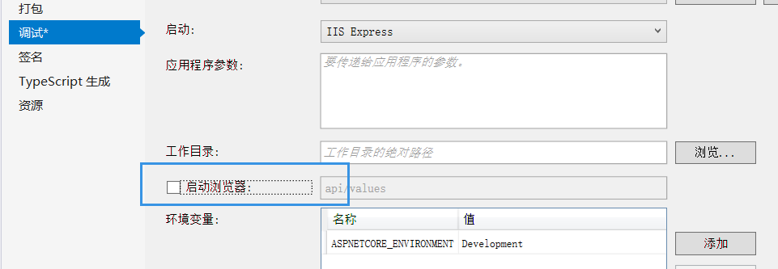

#  微服务持续集成项目结构说明

（ Template：CampusRecruitmentSystem.ASPDotNET_WebAPI_ContinuousIntegration_Template）

---

[TOC]


[Postman IdentityServer4 API 文档](https://documenter.getpostman.com/view/7058343/S1LpaXaF) 用户登陆注册


## 0 集成微服务具体是干什么：

​	微服务的集成也就是说，我们的微服务大环境已经部署好了，各种微服务环境方面的架子（服务发现治理，API网关，JTW权限认证，负载均衡）已经弄完了，每当一个新的服务（如学生发布简历服务|查看岗位信息服务）写好了，可以不重启整个项目大环境，只改一个配置文件，就能将你的新服务加入到微服务系统中来。这样减少了部署项目的时间，也可以灵活调整项目的功能而不影响整个项目的运行。

​	首先你需要购买一个腾讯云或阿里云CentOS服务器（官网搜索关键词#学生机#9.9/月），并且已学会基本ASP.NET搭建API，你只需要改几个文件就能把项目加入到微服务中来。

​	我会从项目的修改说起，然后是你的CentOS服务器方面，然后检查你是否成功部署。下图是你成功部署后在[健康检查服务](http://39.106.206.130:8500/)中能看到的样子：


**让我们开始吧！**


## 1 新建项目（或已经建立好了项目看看这些设置）

建立[.NET Core -> WebApi]项目，去掉勾选Docker和Https(没有证书)

 ### 设置属性：运行时不启动browser




### 配置文件launchSettings 去掉IIS启动，像这样：


applicationUrl 是你 **测试环境** 的url地址（持续集成不用这个）。

wwwroot文件可以删除-因为我们做的是WebApi。

​	如果你做的是MVC项目也可以保留（持续集成同样可以加入MVC应用，但强烈推荐WebApi先后端分离）


## 2 Nuget添加微服务插件：

打开Nuget搜索插件：


安装这些插件：

- Consul  
- IdentityModel


## 3 参照Template修改Program.cs文件

使得Program可以从Terminal获取端口号，而不是写死在项目中。


## 4 参照Template修改Startup.cs文件

01 首先新建文件夹和文件 Service/RestTemplate.cs

02 新建一个Controller HealthController.cs 作为服务发现的健康检查文件

03 再参照Startup.cs修改你的配置（添加Consul 和 Identityserver4）


## 5 启动文件，查看是否能在服务发现注册

01 打开 [健康检查网址](http://39.106.206.130:8500/) 可以看到已经部署好的微服务模块。

02 启动你的项目 ，【这是由于你没有在Terminal配置你的`--port`端口号】 所以端口号是随机分配的。

03 刷新健康检查网址，你可以看到你的服务被注册上去了。


但是你会看到有个**小红叉**因为你的服务没有公网ip无法被健康检查访问到，过一会(长期服务健康检查会被反注册)或者你关闭项目，再刷新网页你会发现你的服务被反注册了。

###  · 如何使用Terminal运行你的项目：

#### 01 debug模式：

点击生成解决方案


右键点击你的项目，选中在资源文件管理器中打开你的文件夹。

进入bin/debug文件夹一直到看到你的项目文件。


打开`CMD`或者`Shift+右键`选择`在此处打开Powershell端口，` 输入`dotnet You_Program.dll --port youportNumber`

这样就可以了我们可以看到:arrow_down:在Consul中服务的端口和你注册的一样：


## 6 使用IdentityServer控制登陆注册和API访问权限

### 用户登陆注册

[IentityServer4可以获得唯一键值UserID&UserType 相信很多问题都可以通过UserID来解决]

[查看Postman中写好的IdentityServer4 API文档](<https://documenter.getpostman.com/view/7058343/S1LpaXaF>)：

**测试用户**

| 用户名 | 密码 | Role |
| - | :-: | -: |
| 860682501 | 12345678 | student |
| 857160283 | 12345678 | company |
| 17608502435 | 12345678 | school |
| admin00 | admin00 | admin |


**ApiResource[Scopes]** 注册服务到IS4时一定要是这个里面包含的服务

| ApiResource名称 | 说明 |
| - | - |
| Student_basic |			| (测试服务) |
| OcelotService				| 网站网关服务 |
| Student_Info_Service		| 学生资料服务 |
| Company_Info_Service		| 企业资料服务 |
| Recruitment_Info_Service	| 企业招聘信息发布与跟踪服务 |
| School_Info_Service		| 	学校服务 |
| System_ Analyze_Service	| 网站信息分析服务 |


**client_id 登陆模式** [加密方式Sha256(),IS4自动加密]


| client_id | client_secret | 描述 | scopes |
| - | - | - | - |
| auth.student | student authorize | 学生 | "StudentService_Basic"(测试用),"OcelotService", "School_Info_Service", "Company_Info_Service", "Recruitment_Info_Service", "School_Info_Service" |
| auth.company | company | 企业 | "OcelotService", "School_Info_Service", "Company_Info_Service", "Recruitment_Info_Service", "School_Info_Service" |
| auth.school | school | 学校 |"OcelotService", "School_Info_Service", "Company_Info_Service", "Recruitment_Info_Service", "School_Info_Service" |
| auth.admin | admin | 管理员 |"OcelotService", "School_Info_Service", "Company_Info_Service", "Recruitment_Info_Service", "School_Info_Service", "System_ Analyze_Service" |


### 控制API访问权限

找到系统自动生成的测试控制体类ValuesController.cs

在没有加权限之前所有的所有的HTTP请求都能够访问这个类，在类的class或者方法名上添加注解标签`[Authorize]`，就可以使用，我们已经在startup里注册的IdentityServer4授权服务器进行权限检验.

没有授权的会请求会返回401 Unauthorized

注解标签`[Authorize]`还可以写成`[Authorize(Roles = "student")]` 控制具体认证角色访问（角色请参考**测试用户表**中的从Role）。

（你可以使用Studentservice_basic做使用测试，详情参见[**IdentityServer4_API文档**](<https://documenter.getpostman.com/view/7058343/S1LpaXaF#c9e28757-6c9d-4b38-9d0f-eeaa0b338e28>)）

**至此你的服务已经成功实现了微服务接入 接下来就要开始部署了！**

## 7 部署服务

### 简述：

部署一般是将项目发布在Linux机器上一直运行，并且拥有公网ip可以进行连接，这里我推荐CentOS服务器（腾讯云或者阿里云都可以）。

部署分为Linux真机部署和Linux中从Docker虚拟容器部署，使用Docker可以在一个Linux服务器中部署多个不同的服务而且CPU消耗小。(相当于一个服务器安装多个Liux虚拟机，而cpu载荷大大小于开启虚拟机的消耗。)

由于Docker需要一定的学习成本，这里我教一下如何在Cent服务器OS部署（Linux真机部署）你的服务。

### 首先你需要购买一台云服务器

学生优惠很便宜的，购买好后要配置**安全组**和**连接密码**。

我的腾讯云学生机到期了，这里演示阿里云服务器，两者很相似。

官网搜索学生优惠，进行学生认证后，选择购买一台云服务器。直接买IaaS云服务器CentOS，不要购买应用服务器。一个月就可以的，后期想用可以续费的。

### 配置连接密码和安全组规则

配置你的远程登陆密码，用于ssh连接。我们的操作不会直接在这个网页界面，会使用ssh连接工具。

安全组规则，安全组规则相当于这个网络连接的出方向和入方向的防火墙，建议全打开免得麻烦`0.0.0.0/0  1/65535` 

###  远程连接你的服务器

这里我推荐一个软件叫做FinalShell，有监控 有terminal 可以多开 还可以拖拽传输文件。

使用 公网ip 用户名root 密码yourPwd 连接。然后就可以连接了。

### 安装并运行mysql

这个网上有很多教程，这里只提醒一下，远程连接需要配置的指令：

```shell
// 登陆：
mysql -u root -p 

// 给用于授予权限
grant all privileges on *.*  to 'root'@'%';  
// 修改用户的密码和加密方式
ALTER USER 'root'@'%' IDENTIFIED WITH mysql_native_password BY 'root';  
flush privileges;  // 刷新权限
```

如果你在这一块遇到问题，可以向我要一个mysql服务器连接字符串，我分你一个Docker数据库使用。

.NET Core的MySQL连接我之前的教程：

```c#
EFCore SQLServer 转 Mysql：
-1 建立appsettings.json文件 编写你的数据库连接字符串
"ConnectMysqlBDString": "server=localhost;port=3306;userid=root;pwd=root;database=IS4DB;sslmode=none;Charset=utf8"
(https://github.com/860682501/CampusRecruitmentSystem/blob/master/CampusRecruitmentSystem/IdentityProgram/appsettings.json)

-2 Startup.cs 注入配置文件 并更换EFCore连接字符串
（https://github.com/860682501/CampusRecruitmentSystem/blob/master/CampusRecruitmentSystem/IdentityProgram/Startup.cs）
```


```c#
-3 通过数据迁移语句重新由类生成数据库（推荐数据库不要写外键，用C#逻辑来填入外键，个人观点）
（数据查询尽量用Async Task await 异步调用，加快服务性能）
这个是我在这个项目中 工作的Github地址 用到EFCore+MySQL的地方：(https://github.com/860682501/CampusRecruitmentSystem/tree/master/CampusRecruitmentSystem/IdentityProgram)
```


### 安装dotnet

``` shell
// 将.NET产品订阅源添加到系统
sudo rpm --import https://packages.microsoft.com/keys/microsoft.asc
sudo sh -c 'echo -e "[packages-microsoft-com-prod]\nname=packages-microsoft-com-prod \nbaseurl= https://packages.microsoft.com/yumrepos/microsoft-rhel7.3-prod\nenabled=1\ngpgcheck=1\ngpgkey=https://packages.microsoft.com/keys/microsoft.asc" > /etc/yum.repos.d/dotnetdev.repo'

// 使用YUM安装最新的.NET SDK
sudo yum update -y
sudo yum install libunwind libicu -y
sudo yum install dotnet-sdk-2.1.4 -y

// 为了确认结果，您可以创建并运行“Hello World”演示.NET Core应用程序：
cd dotnet new console -o helloworldApp
cd helloworldApp
dotnet run

// 设置防火墙规则
sudo firewall-cmd --zone=public --permanent --add-service=http
sudo firewall-cmd --zone=public --permanent --add-service=https
sudo firewall-cmd --reload

```

输入dotnet 会出现一段文字而不是未找到指令，就说明安装成功了


### 部署项目

01 VS2017发布你的程序 


找到你的发布文件夹

02 CentOS 新建文件夹 ` mkdir /home/service_data/your_service_program_name` 文件夹

03 将你的项目全选拖入`your_service_program_name`

04 进入你的这个文件夹，启动文件，不要忘了加上设定端口`--port portNumber`

```shell
dotnet YouProgramName --port 5050
```

05 打开Consul查看是否注册成功，这个时候你的服务因该不会有小叉叉，如果健康检查还是不成功，检查一下你的项目文件 startup 中 ip地址注册 是否正确。

06 这样微服务就部署成功了。

## 8 附加：后台运行程序

你可能还需要了解如何让项目在后台运行，请参考这个文章：

[Linux 下后台运行程序，查看和关闭后台运行程序](https://blog.csdn.net/u013846293/article/details/74003051/)


